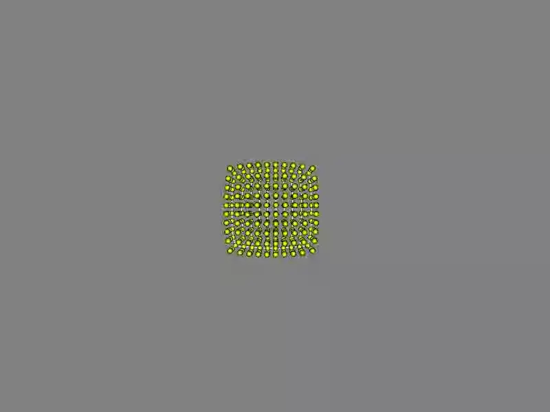

## WebFMM
This project implements the use of WebGPU in a browser environment to run FMM (Fast Multipole Method) for solving layout calculations of Node-Link diagrams.

The force-directed methods, which is commonly used for layout calculations, contains an N-body problem with a computational complexity of O(N²). FMM can reduce the computational complexity to O(N).

Demo Page: <https://czfaero.github.io/WebFMM/>

### To-do:
Solve randomly appearing NaN.

